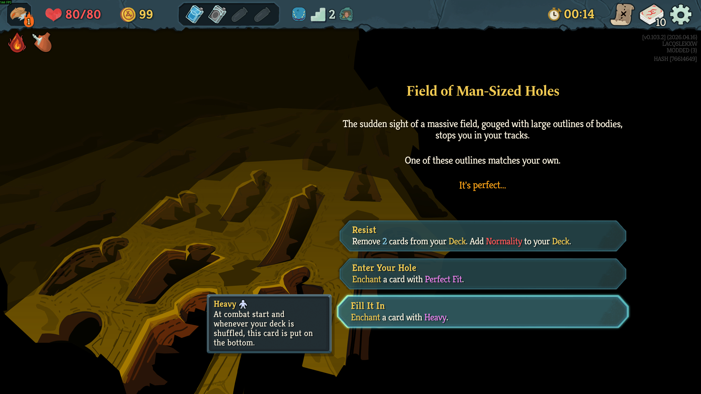

# Heavy Enchantment



Adds a `Heavy` enchantment option to Field of Man-Sized Holes.

## What It Does

The event keeps its existing options and gains a third option beneath them: `Heavy`.
Choosing it opens the normal deck enchantment selector and applies the custom `Heavy` enchantment to one eligible card.

`Heavy` uses the Perfect Fit icon and adds `Heavy` to the enchanted card's extra text. At combat start and during non-initial deck shuffles, the enchanted card is moved to the bottom of the draw pile.

## How It Works

- [Code/Enchantments/Heavy.cs](Code/Enchantments/Heavy.cs) defines the custom enchantment as a native `EnchantmentModel`.
- [Code/Patches/FieldOfManSizedHolesHeavyOptionPatch.cs](Code/Patches/FieldOfManSizedHolesHeavyOptionPatch.cs) appends the event option and performs the enchantment flow.
- [HeavyEnchantment/localization/eng/enchantments.json](HeavyEnchantment/localization/eng/enchantments.json) and [HeavyEnchantment/localization/eng/events.json](HeavyEnchantment/localization/eng/events.json) provide the UI text.

## Building

See [the root README](../README.md#building) for the full toolchain requirements and `.env` setup. Once `GODOT_EXE` is configured:

```powershell
cd HeavyEnchantment
./build.ps1
```

This produces `HeavyEnchantment.pck` and `bin/Debug/HeavyEnchantment.dll`.

## Installing

Run `./install.ps1` from this directory after building.
