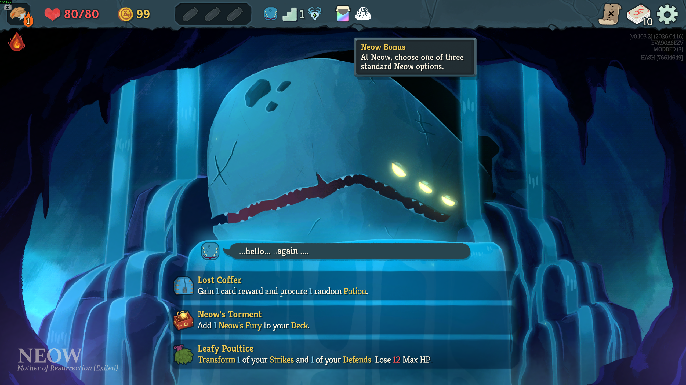

# Neow Custom Mode



A small Slay the Spire 2 mod that adds a Neow bonus modifier to custom runs.

## What It Does

Neow Custom Mode adds a good custom-run modifier named **Neow Bonus**. When selected, Neow shows the same three-option relic choice used by normal runs: two positive options and one cursed option.

This is intended for custom runs that use other modifiers, where the normal Neow bonus choices are not shown.

## How It Works

This mod follows a code-only Harmony project shape:

- [Code/ModEntry.cs](Code/ModEntry.cs) applies Harmony patches on load.
- [Code/Modifiers/NeowBonus.cs](Code/Modifiers/NeowBonus.cs) defines the custom modifier marker.
- [Code/Patches/GoodModifiersPatch.cs](Code/Patches/GoodModifiersPatch.cs) appends the modifier to `ModelDb.GoodModifiers`.
- [Code/Patches/NeowBonusChoicePatches.cs](Code/Patches/NeowBonusChoicePatches.cs) replaces the marker option with a standard three-option Neow choice and then continues the custom-modifier Neow sequence.

## Building

See [the root README](../README.md#building) for the full toolchain requirements and `.env` setup. Once `GODOT_EXE` is configured:

```powershell
cd NeowCustomMode
./build.ps1
```

This produces `NeowCustomMode.pck` and `bin/Debug/NeowCustomMode.dll`.

## Installing

From the `NeowCustomMode/` directory:

```powershell
./install.ps1
```

`install.ps1` copies the DLL, PDB, deps.json, PCK, manifest, and mod image into `<sts2>/mods/NeowCustomMode/`.
