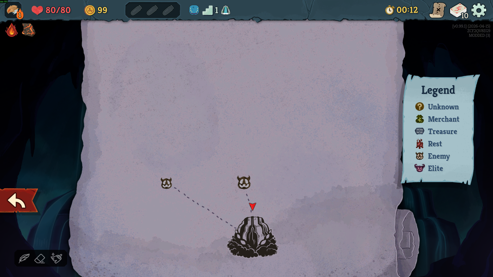
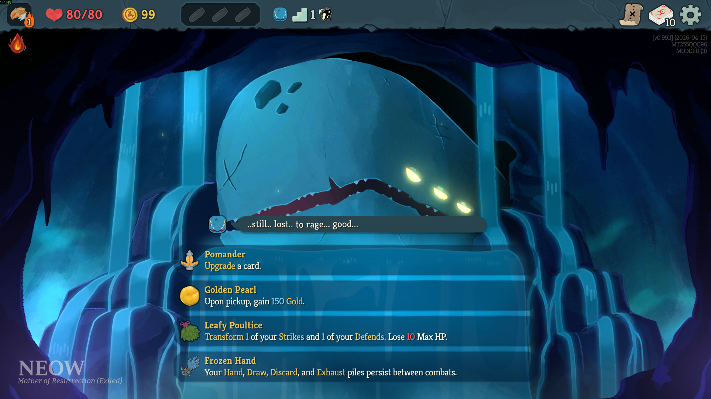
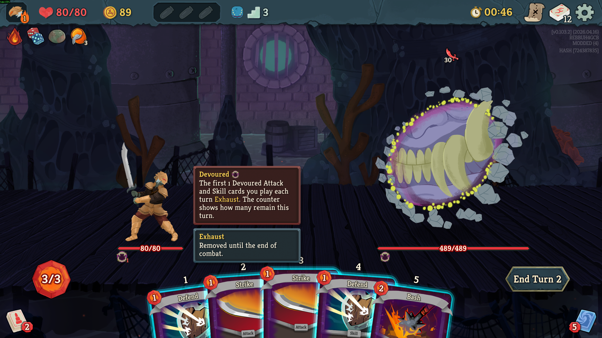

# sts2-custom-mods

Personal repo of Slay the Spire 2 gameplay mods. Three mods live here today: **Fog of War**, **Frozen Hand**, and **Door Remaker**. All are DLL + PCK mods built against Godot 4.5.1 Mono and require [BaseLib](https://github.com/Alchyr/BaseLib-StS2).

## Mods

### Fog of War



Hides map nodes and path lines. On any given map, only the act boss, nodes already traveled, the current node, and the current node's direct children are visible. Path lines are only drawn when both of their endpoints are visible. See [FogOfWar/README.md](FogOfWar/README.md).

### Frozen Hand



Adds a custom Ancient relic, *Frozen Hand*, offered as an extra choice at Neow. When taken, it snapshots the player's hand, draw, discard, and exhaust at the end of each combat and restores them, in the exact same order, at the start of the next combat instead of the normal shuffle. See [FrozenHand/README.md](FrozenHand/README.md).

### Door Remaker



A mod for reworking the Act 3 Doormaker boss encounter (built for STS2 v0.103.2). DoorRemaker currently implements a Hunger-phase redesign and leaves the rest of the Doormaker fight vanilla. Instead of exhausting every card during the phase, it starts by exhausting 1 card, scaling by 2 every phase. See [DoorRemaker/README.md](DoorRemaker/README.md).

## Repo Layout

```text
sts2-custom-mods/
|-- sts2-custom-mods.sln     # solution (also refs .tmp/ModTemplate, gitignored)
|-- .env.example             # template for repo-root .env (GODOT_EXE)
|-- DoorRemaker/             # Door Remaker mod scaffold
|-- FogOfWar/                # Fog of War mod
`-- FrozenHand/              # Frozen Hand mod
```

## Toolchain

All mods are pinned to:

- `Godot.NET.Sdk/4.5.1` - do **not** upgrade to 4.6.x; the game ships on 4.5.1.
- `net9.0`
- `Alchyr.Sts2.BaseLib` `0.1.*`
- Game references: `sts2.dll`, `0Harmony` (picked up from the Slay the Spire 2 install)

Each project imports `Sts2PathDiscovery.props`, which auto-discovers the Slay the Spire 2 install on Windows, Linux, and macOS. If discovery fails, override `Sts2DataDir` in the project's `Directory.Build.props`. Builds hard-fail if `Sts2DataDir` cannot be resolved; there is no silent fallback.

## Building

Each mod has its own `build.ps1`. There is no top-level build.

1. Copy `.env.example` to `.env` at the repo root and set `GODOT_EXE` to your Godot 4.5.1 Mono **console** executable, the `..._console.exe` binary. Standard output visibility matters for export debugging.
2. From the mod directory, run `./build.ps1`. The script:
   - runs `dotnet build` sourced only from your local NuGet cache; a cold machine may need a manual restore first,
   - calls Godot `--export-pack` to produce the `.pck`,
   - cleans up `.godot/`, `obj/`, and any stray files in `bin/Debug/`.

Artifacts land at `<Mod>/<Mod>.pck` and `<Mod>/bin/Debug/<Mod>.dll`. Both are gitignored.

## Installing

Installation is intentionally separate from build. Each mod goes into its own subfolder under the game's `mods/` directory:

```text
<Slay the Spire 2 install>/mods/<ModId>/
```

On a default Windows Steam install that's `C:\Program Files (x86)\Steam\steamapps\common\Slay the Spire 2\mods\<ModId>\`. The game discovers mods by scanning that directory and reading each `mod_manifest.json`; there is no registry or config file to update. Each mod folder should contain:

- `<ModId>.dll`, `<ModId>.pdb`, `<ModId>.deps.json` from `bin/Debug/`
- `<ModId>.pck` from the project root
- `mod_manifest.json` and `mod_image.png` from the project root

Each mod has an `install.ps1` that copies the freshly-built artifacts into the game's `mods/<ModId>/` folder. From the mod's project directory:

```powershell
./install.ps1
```

The script derives the mod name from the folder, verifies all six artifacts exist, then copies them. If a build artifact is missing it fails loudly and tells you to run `./build.ps1` first. The install path is hardcoded to the default Windows Steam location; edit the `$sts2` line in the script for a non-default install.

All current `mod_manifest.json` files declare `has_pck`, `has_dll`, `dependencies: ["BaseLib"]`, and `affects_gameplay: true`. **BaseLib must already be installed** in `<Slay the Spire 2 install>/mods/BaseLib/` before these mods will load.

## Maintenance Notes

The mods in this repo reach into private game internals via Harmony and related reflection helpers. Game updates can break a mod without any repo changes. The specific surfaces each mod depends on are documented in that mod's README.
